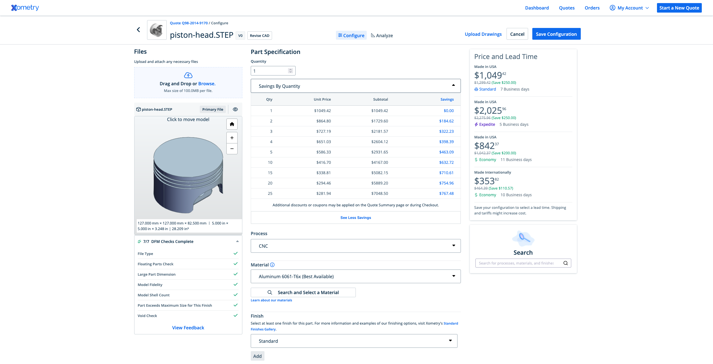

# CAD Quoting Engine
This project implements a multimodal pipeline capable of analyzing 3D CAD files and generating real-time cost and lead time estimates for CNC machining. It leverages tools like `trimesh`, `cadquery`, and `pythonOCC` to extract geometric features and estimate manufacturing complexity. The engine outputs per-unit costs, material breakdowns, and machining time, helping automate the manufacturing sourcing process.

## Overview and Background

This quoting engine demonstrates an end-to-end pipeline for analyzing 3D CAD files and generating automated manufacturing cost estimates. It supports standardized formats like STEP and uses geometry processing tools such as `trimesh`, `cadquery`, and `pythonOCC` to extract precise measurements including bounding box dimensions, surface area, and part volume. The engine also detects key geometric features like holes, sharp edges, and pockets to assess part complexity. These features are used to drive a cost model that considers material properties (e.g., aluminum density and price), machining time, and economies of scale across different quantities.

Once the geometric and physical data is extracted, the system computes a detailed cost breakdown and lead time estimate. The cost is composed of material and machine time components, adjusted for complexity and volume-based discounts. Lead time is derived from the estimated cycle time and part count, with optional multipliers for specific material or design factors. By simulating core aspects of a real manufacturing quoting workflow, the engine provides engineers with immediate, data-driven estimates to accelerate sourcing decisions.

